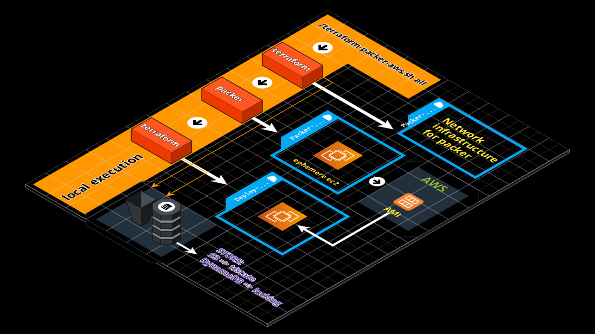
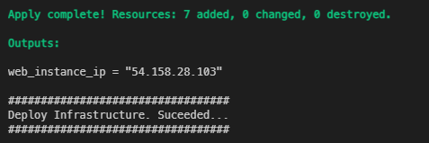
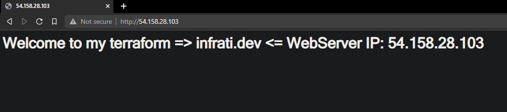
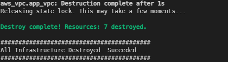

[](https://infrati.dev)

### Projeto terraform packer aws

### Contents 
  - [scripts](scripts/)
  - [terraform-packer-build-aws](terraform-packer-build-aws/)
  - [terraform-packer-deploy-aws](terraform-packer-deploy-aws/)
  - [terraform-packer-network-aws](terraform-packer-network-aws/)

### Projeto terraform packer aws



- Esse projeto será executado localmente. Projeto foi adaptado para ser executado também com o github-action nesse repositório [terraform-packer-aws-github-action](https://github.com/infratidev/terraform-packer-aws-github-action)
- Em uma ```única ação```, ao executar o script ```./terraform-packer-aws.sh``` com o parâmentro ```all``` ```./terraform-packer-aws.sh all``` será executado:
    - Através do terraform, o provisionamento da infraestrutura de rede para o packer realizar o build utilizando a AWS.
    - Após infraestrutura de rede pronta, o packer irá realizar o build da imagem na AWS utilizando a infraestrutura de rede específica, onde será executado o script ```userdata.sh``` instalando um servidor apache.
    - AMI criada e disponível na AWS, será provisionado com o terraform uma infraestrutura nova para deploy de uma ec2 com a imagem criada pelo packer.
    - tfstate da infraestrutura de network e deploy estão separadas, utilizando S3 para armazenar o state e dynamoDB para locking.

### Requiriments

* Terraform instalado, nesse caso utilizado v1.2.6
* Credenciais de acesso já criadas no IAM com as permissões necessárias para o S3 e Dynamodb
* aws_access_key_id e aws_secret_access_key geradas.
* Estrutura para remote state criada. Link para provisionar a estrutura: [Estrutura Remote State](https://github.com/infratidev/terraform-aws/tree/main/07-remote-state-packer-aws)

### Working DIR

Estrutura criada para execução do script ```terraform-packer-aws.sh``` dentro da pasta ```scripts```

### Provisionamento

```./terraform-packer-aws.sh all```

Ao final, será exibido na console.



Acessando IP no navegador:




### Remoção de toda infraestrutura criada, AMIs e snapshots

```./terraform-packer-aws.sh destroy```



<br>

[](https://infrati.dev)


